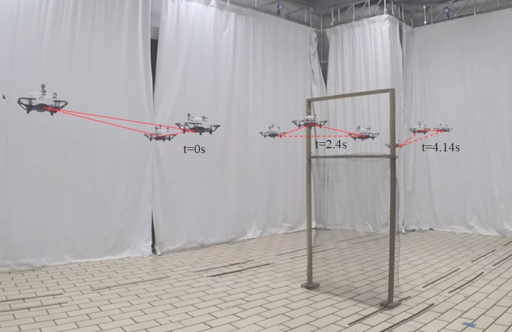

# Formation-Maneuvering-UAVs
This is the supplementary experimental note of the paper: Angle-Constrained Formation Maneuvering of Unmanned Aerial Vehicles, which is published in IEEE TCST, 2023. These notes show how to implement and launch the formation maneuvering of UAVs, in which the UAVs' desired formation is specified by a set of inter-UAV interior angles.
If you are interested, please cite

```
@ARTICLE{10040975,
  author={Chen, Liangming and Xiao, Jiaping and Lin, Reuben Chua Hong and Feroskhan, Mir},
  journal={IEEE Transactions on Control Systems Technology}, 
  title={Angle-Constrained Formation Maneuvering of Unmanned Aerial Vehicles}, 
  year={2023},
  volume={},
  number={},
  pages={1-14},
  doi={10.1109/TCST.2023.3240286}}
```
## Abstract
In a global positioning system (GPS)-denied environment, unmanned aerial vehicles (UAVs) rely on local sensing-based formation maneuvering approaches for collective motion. To improve mission efficiency by reducing the total sensing requirements on all UAVs, this article proposes a leader–follower formation maneuvering framework with two leaders, where the followers will track the two leaders and maintain a desired angle-constrained formation with respect to the leaders using direction-only measurements, i.e., removing the need for inter-UAV distance measurements for the followers. To enable the UAV formation to maneuver in translation, rotation, and scaling simultaneously, the desired formation shape is specified by a set of interior angle constraints. By assigning each UAV’s yaw angle and position as the four controllable variables, an estimation-based attitude control algorithm is designed. For the UAVs’ position control, the designed formation maneuvering algorithm consists of a velocity tracking part and a formation shape control part that enables the first leader UAV to control the translational maneuvering, the second leader UAV to control the rotational and scaling maneuvering, and all the follower UAVs to maintain the formation shape. Simulations and experiments on UAVs’ formation maneuvering are conducted to illustrate the effectiveness of the proposed approach.


<div style="text-align: center">

</div>

The video refers to [https://www.bilibili.com/video/BV1pA411k7Xt/?vd_source=70071848c9820cf0bdf1c33437ab4486].


